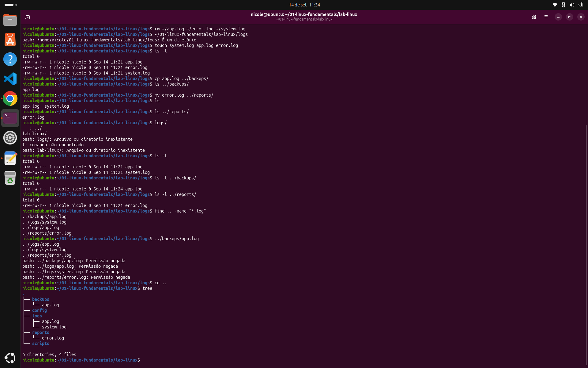

# 🐧 Linux Fundamentals

Laboratório prático desenvolvido para consolidar os fundamentos do Linux e da linha de comando (CLI).

## 🎯 Objetivo

Desenvolver familiaridade com o ambiente Linux por meio da prática, entendendo não apenas quais comandos utilizar, mas também o que acontece no filesystem a cada operação.

## 🧪 Conteúdos praticados

- Navegação pelo filesystem
- Caminhos absolutos e relativos
- Criação de diretórios e arquivos
- Cópia, movimentação e remoção de arquivos
- Localização de arquivos e diretórios
- Visualização da estrutura de diretórios
- Uso da linha de comando (CLI)

## 🛠️ Comandos utilizados

`pwd` · `ls` · `cd` · `mkdir` · `touch` · `cp` · `mv` · `rm` · `find` · `tree`

## 🧩 Exercício 01 — Navegação e filesystem

Criar e organizar a seguinte estrutura:

```text
lab-linux/
├── logs/
├── scripts/
├── backups/
├── config/
└── reports/
Além da criação dos diretórios, foram criados arquivos de log e realizadas operações de cópia, movimentação e localização de arquivos.

---

## 🔨 Atividades realizadas

Durante o exercício foram realizadas as seguintes atividades:

1. Verificação do diretório atual utilizando `pwd`
2. Navegação pelo filesystem utilizando `cd`
3. Listagem de arquivos e diretórios utilizando `ls`
4. Criação dos diretórios utilizando `mkdir`
5. Criação dos arquivos utilizando `touch`
6. Cópia de arquivos utilizando `cp`
7. Movimentação de arquivos utilizando `mv`
8. Localização de arquivos utilizando `find`
9. Visualização da estrutura final utilizando `tree`

---

## 🛠️ Comandos utilizados

| Comando | Função |
|---|---|
| `pwd` | Exibe o diretório atual |
| `ls` | Lista arquivos e diretórios |
| `cd` | Navega entre diretórios |
| `mkdir` | Cria diretórios |
| `touch` | Cria arquivos |
| `cp` | Copia arquivos e diretórios |
| `mv` | Move ou renomeia arquivos e diretórios |
| `rm` | Remove arquivos e diretórios |
| `find` | Localiza arquivos e diretórios |
| `tree` | Exibe a estrutura de diretórios em formato de árvore |

---

# 📂 Estrutura criada

A estrutura utilizada no laboratório foi organizada da seguinte forma:

```text
01-linux-fundamentals/
├── backups/
│   └── app.log
├── config/
├── logs/
│   ├── app.log
│   └── system.log
├── reports/
│   └── error.log
├── screenshots/
│   └── exercicio-01-filesystem.png
└── scripts/
```

### Organização dos diretórios

- `logs/` → armazenamento dos arquivos de log
- `scripts/` → diretório destinado a scripts
- `backups/` → armazenamento de cópias de arquivos
- `config/` → diretório destinado a arquivos de configuração
- `reports/` → armazenamento de relatórios
- `screenshots/` → evidências da execução dos exercícios

Durante o exercício, o arquivo `app.log` foi copiado para `backups/` e o arquivo `error.log` foi movido para `reports/`.

---

# 📍 Caminhos absolutos e relativos

Um dos conceitos praticados durante o laboratório foi a diferença entre caminhos absolutos e relativos.

## Caminho absoluto

Um caminho absoluto representa a localização completa de um arquivo ou diretório a partir da raiz do sistema `/`.

Exemplo:

```text
/home/nicole/01-linux-fundamentals
```

O caminho absoluto não depende do diretório atual para determinar a localização do recurso.

---

## Caminho relativo

Um caminho relativo utiliza o diretório atual como ponto de referência.

Exemplo:

```text
../backups
```

Nesse caso, `..` representa o diretório pai do diretório atual.

Outro exemplo:

```text
./logs
```

Nesse caso, `.` representa o diretório atual.

Durante o exercício, os caminhos relativos foram utilizados para realizar operações de cópia e movimentação entre os diretórios.

---

# 🔎 Localização de arquivos

O comando `find` foi utilizado para localizar arquivos dentro da estrutura criada.

Exemplo:

```bash
find .. -name "*.log"
```

Esse comando permite procurar arquivos com a extensão `.log` a partir do diretório indicado.

A utilização do `find` ajudou a compreender como localizar arquivos sem precisar navegar manualmente por todos os diretórios.

---

# 🌳 Visualização da estrutura

O comando `tree` foi utilizado para visualizar a organização dos diretórios e arquivos em formato de árvore.

Exemplo:

```bash
tree
```

O resultado permitiu verificar visualmente se a estrutura criada estava organizada conforme o esperado.

---

# 🐛 Erros encontrados durante a prática

Durante a realização do laboratório, alguns erros aconteceram.

Esses erros fizeram parte do processo de aprendizado e ajudaram a compreender melhor como o terminal e o Bash interpretam os comandos.

---

## 1. Diretório não encontrado

Em determinado momento foi utilizado:

```bash
cd lab-linux/logs
```

O terminal retornou um erro informando que o diretório não existia.

O problema aconteceu porque o comando foi executado a partir de um diretório diferente daquele considerado no caminho informado.

### Aprendizado

Foi possível perceber que o `cd` interpreta o caminho relativo a partir do diretório atual.

Por isso, antes de navegar ou executar operações em arquivos, é importante verificar o diretório atual utilizando:

```bash
pwd
```

e visualizar o conteúdo disponível com:

```bash
ls
```

---

## 2. Tentativa de executar um diretório

Durante a prática, foi digitado:

```bash
logs/
```

O Bash interpretou `logs/` como algo que deveria ser executado, e não como uma instrução de navegação.

### Aprendizado

Para entrar em um diretório é necessário utilizar o comando:

```bash
cd logs/
```

Isso ajudou a compreender a diferença entre informar um caminho e executar um comando.

---

## 3. Tentativa de executar um arquivo de log

Também ocorreu uma tentativa de utilizar diretamente um caminho como:

```bash
../backups/app.log
```

O Bash interpretou o arquivo como um programa que deveria ser executado.

Como o arquivo não possuía permissão de execução, foi retornado:

```text
Permission denied
```

### Aprendizado

Um caminho de arquivo sozinho não significa abrir ou visualizar o arquivo.

Para trabalhar com seu conteúdo, é necessário utilizar um comando apropriado, por exemplo:

```bash
cat ../backups/app.log
```

Esse erro ajudou a compreender melhor que o shell interpreta o primeiro elemento digitado como um comando ou programa a ser executado.

---

# 🔍 Investigação e resolução

Os erros encontrados durante o exercício fizeram parte do processo de aprendizado.

Ao invés de apenas repetir comandos, foi necessário analisar:

- Qual era o diretório atual
- Qual caminho estava sendo utilizado
- Se o arquivo ou diretório realmente existia
- Como o Bash estava interpretando o comando
- Qual comando deveria ser utilizado para realizar a operação desejada

Essa prática ajudou a desenvolver uma abordagem mais voltada para **investigação e troubleshooting**, que é fundamental em ambientes Linux e DevOps.

---

# 📸 Evidência

A evidência da execução deste laboratório está disponível na pasta:

```text
screenshots/
```

Arquivo:

```text
screenshots/exercicio-01-filesystem.png
```

A imagem registra a execução prática realizada no terminal e a estrutura criada durante o exercício.



---

# 🧠 O que aprendi

Ao finalizar este laboratório, consolidei conhecimentos sobre:

- Navegação pelo filesystem
- Utilização da linha de comando
- Caminhos absolutos e relativos
- Criação de arquivos e diretórios
- Cópia e movimentação de arquivos
- Localização de arquivos com `find`
- Visualização da estrutura com `tree`
- Interpretação de mensagens de erro
- Diferença entre navegar até um arquivo e tentar executá-lo
- Importância de verificar o diretório atual antes de executar operações

O principal aprendizado foi perceber que trabalhar com Linux não envolve apenas memorizar comandos.

É necessário entender **o contexto da operação**, observar o resultado dos comandos e interpretar as mensagens retornadas pelo sistema.

Quando um comando apresenta um erro, a mensagem exibida pelo terminal pode fornecer informações importantes para identificar a causa do problema e encontrar uma solução.

Essa forma de pensar será importante nos próximos estudos de Linux, Redes e posteriormente em atividades de troubleshooting dentro de ambientes DevOps.


- Controle de acesso a arquivos e diretórios

O objetivo é continuar evoluindo a partir dos fundamentos do Linux e avançar gradualmente para conceitos utilizados no dia a dia de ambientes DevOps.
