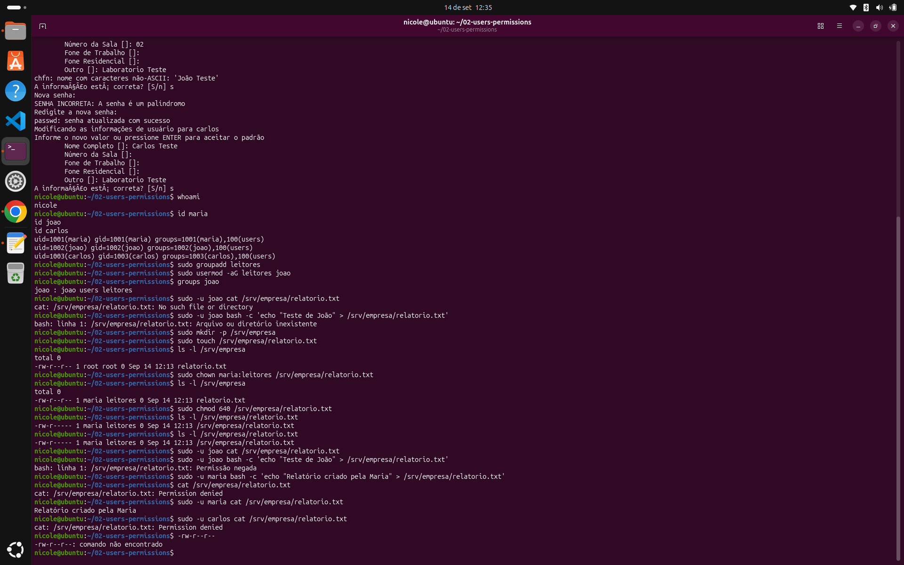
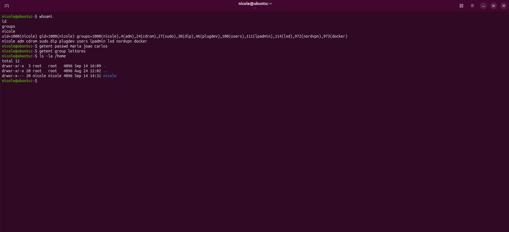

# 👤 Users & Permissions

Segundo laboratório prático da minha preparação para atuar com **DevOps**.

Neste laboratório pratiquei a criação e gerenciamento de usuários, grupos e permissões no Linux, simulando um ambiente onde diferentes usuários possuem diferentes níveis de acesso.

---

## 🎯 Objetivo

Praticar:

- criação e gerenciamento de usuários;
- criação e gerenciamento de grupos;
- permissões de arquivos;
- proprietário e grupo;
- `whoami`;
- `id`;
- `groups`;
- `chmod`;
- `chown`;
- troubleshooting de acesso.

O objetivo foi entender **por que um usuário consegue ou não acessar determinado recurso**.

---

## 👥 Usuários e grupos

Criei três usuários para o laboratório:

```text
maria
joao
carlos
```

Também criei o grupo:

```text
leitores
```

e associei o usuário `joao` ao grupo.

Para verificar as informações dos usuários e grupos, utilizei:

```bash
whoami
id
groups
getent passwd
```

---

## 🔐 Permissões

Utilizei:

```bash
ls -l
chmod
chown
```

para analisar e modificar permissões e proprietários.

A prática ajudou a entender a relação entre:

```text
Proprietário
Grupo
Outros
```

e as permissões:

```text
Leitura
Escrita
Execução
```

Também criei um arquivo de teste em `/srv/empresa/relatorio.txt` e alterei seu proprietário, grupo e permissões para simular diferentes níveis de acesso.

---

## 🧪 Testes e erros

Durante os testes, ocorreram alguns problemas de autenticação e acesso.

Entre eles:

```text
Erros de validação de senha
Permission denied
```

Também encontrei situações em que um usuário não conseguia acessar ou modificar um arquivo devido às permissões configuradas.

Para investigar os problemas, utilizei:

```bash
whoami
id
groups
ls -l
sudo
```

Esses erros foram importantes para entender que uma mensagem como `Permission denied` pode estar relacionada ao usuário, grupo, proprietário ou às permissões configuradas.

---

## 🧹 Limpeza do ambiente

Após concluir os testes, verifiquei os diretórios dos usuários de laboratório e removi as contas criadas exclusivamente para a prática.

Também removi o grupo utilizado nos testes.

Depois de reiniciar o sistema, confirmei que os usuários do laboratório não apareciam mais na tela de login.

---

## 📸 Evidências

A execução do laboratório foi registrada no terminal, incluindo:

- criação e verificação dos usuários;
- criação e associação de grupos;
- configuração de proprietário e permissões;
- testes de acesso;
- situações de `Permission denied`.



A limpeza do ambiente também foi verificada após a remoção das contas e do grupo.



---

## 🧠 O que aprendi

Este laboratório ajudou a entender na prática como o Linux controla o acesso aos seus recursos.

Mais importante do que decorar comandos, comecei a desenvolver o hábito de **investigar a causa de um problema antes de tentar corrigi-lo**.

---


