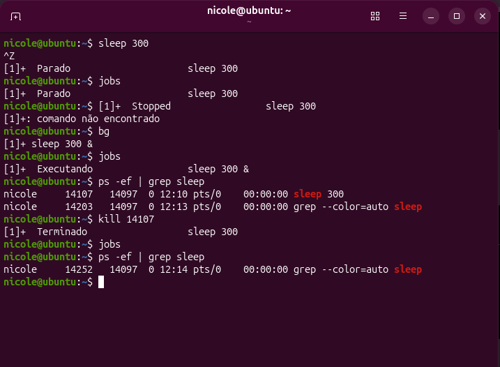
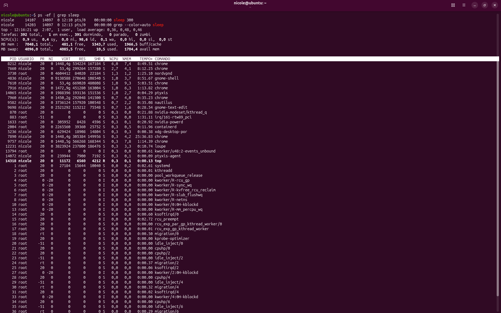

# ⚙️ Processes & Background

Terceiro laboratório prático da minha preparação para atuar com **DevOps**.

Neste laboratório pratiquei o gerenciamento e monitoramento de processos no Linux, trabalhando com processos em execução, processos suspensos e processos em background.

---

## 🎯 Objetivo

Praticar:

- identificação de processos;
- PID (Process ID);
- processos em foreground;
- processos em background;
- suspensão e retomada de processos;
- encerramento de processos;
- monitoramento de processos em tempo real.

O objetivo foi entender **como identificar o que está executando no sistema e como controlar um processo**.

---

## 🔄 Processos em background

Para criar um processo de teste, utilizei:

```bash
sleep 300
```

O processo foi inicialmente executado em foreground.

Depois utilizei:

```text
Ctrl + Z
```

para suspender o processo.

Utilizei:

```bash
jobs
```

para verificar o estado do processo e:

```bash
bg
```

para retomá-lo em background.

---

## 🔎 Identificação de processos

Para identificar o processo em execução, utilizei:

```bash
ps -ef | grep sleep
```

O comando permitiu localizar o processo `sleep` e identificar seu PID.

No laboratório, o processo foi identificado pelo PID:

```text
14107
```

Depois utilizei:

```bash
kill 14107
```

para encerrá-lo.

A execução de `jobs` e uma nova consulta com `ps` confirmaram que o processo havia sido finalizado.

---

## 📊 Monitoramento com top

Também utilizei:

```bash
top
```

para acompanhar os processos do sistema em tempo real.

Durante a análise, observei informações como:

```text
PID
USUARIO
%CPU
%MEM
TEMPO+
COMANDO
```

Essa prática ajudou a entender como identificar processos que estão utilizando recursos do sistema.

---

## 🧪 Troubleshooting

Durante o laboratório, pratiquei uma situação simples de investigação:

> Um processo está sendo executado em background. Como identificar e encerrá-lo?

A investigação foi realizada utilizando:

```bash
jobs
ps -ef | grep sleep
kill
```

A prática ajudou a desenvolver o raciocínio de:

```text
Identificar
   ↓
Encontrar o PID
   ↓
Verificar o processo
  
Encerrar
   ↓
Confirmar
```

---

## 📸 Evidências

### Processos em background

A imagem abaixo registra a criação, suspensão, execução em background, identificação e encerramento do processo.



### Monitoramento com top

A imagem abaixo registra o monitoramento dos processos utilizando `top`.



---

## 🧠 O que aprendi

Este laboratório ajudou a entender que processos possuem estados e identificadores próprios e podem ser acompanhados e controlados pelo sistema.

Também comecei a desenvolver uma abordagem mais prática para troubleshooting:

**identificar o problema, coletar informações, analisar o processo, executar uma ação e confirmar o resultado.**

---


