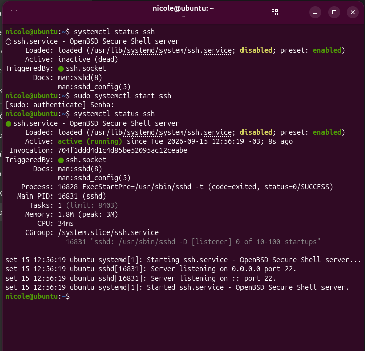
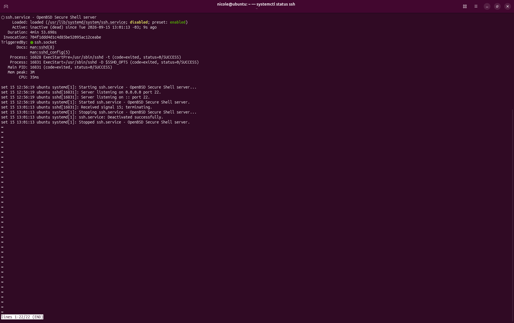
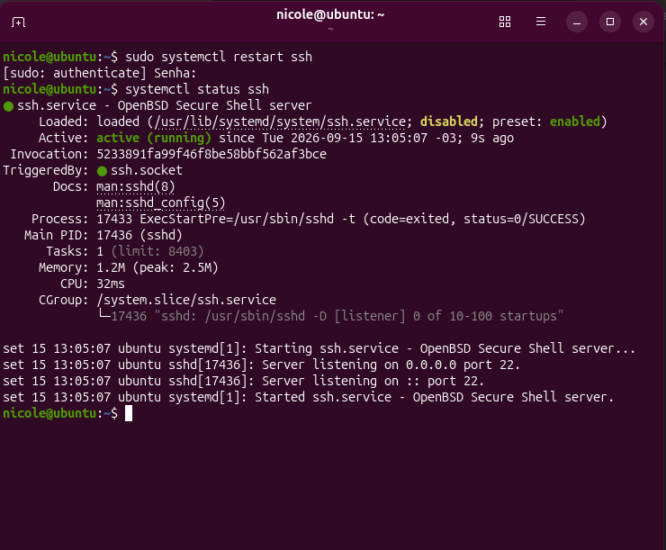
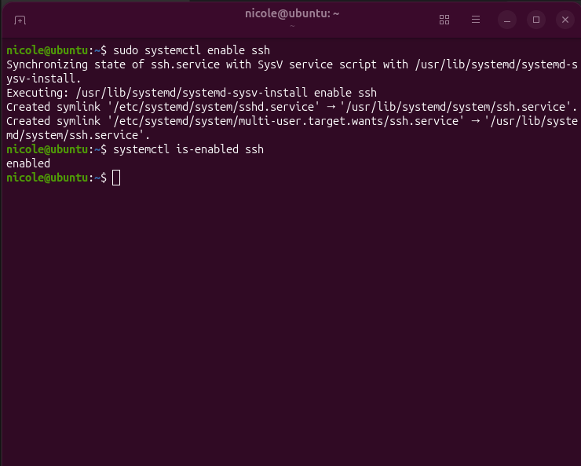
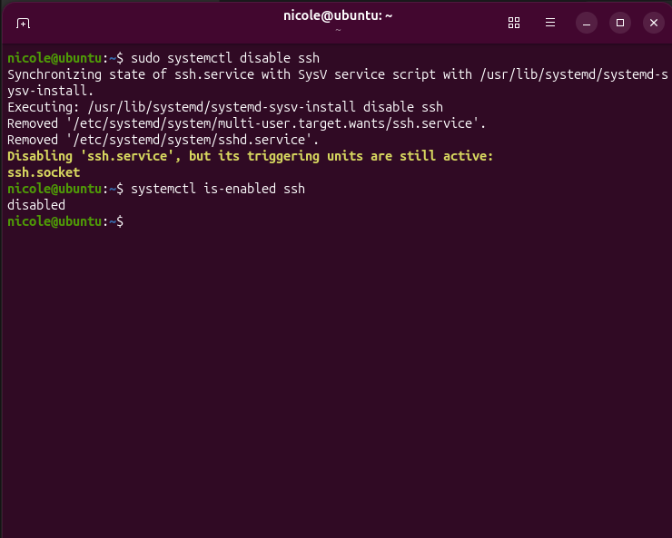

# 🔧 Services

Quarto laboratório prático da minha preparação para atuar com **DevOps**.

Neste laboratório pratiquei o gerenciamento de serviços no Linux utilizando o `systemd`, observando como iniciar, parar, reiniciar, habilitar e desabilitar serviços.

---

## 🎯 Objetivo

Praticar:

- gerenciamento de serviços;
- `systemctl`;
- status de serviços;
- inicialização e parada de serviços;
- reinicialização de serviços;
- inicialização automática no boot;
- identificação de processos associados a serviços;
- troubleshooting básico.

O objetivo foi entender a diferença entre um serviço estar **executando** e estar **habilitado para iniciar automaticamente**.

---

## 🔧 Serviço utilizado

Para os testes utilizei o serviço:

```text
ssh.service
```

O SSH foi escolhido porque é um serviço comum em ambientes Linux e também será utilizado como base para estudos futuros de acesso remoto.

---

## ▶️ Iniciar um serviço

Para iniciar o SSH:

```bash
sudo systemctl start ssh
```

Depois verifiquei seu estado:

```bash
systemctl status ssh
```

O serviço passou para:

```text
Active: active (running)
```

---

## ⏹️ Parar um serviço

Para interromper o serviço:

```bash
sudo systemctl stop ssh
```

Depois confirmei:

```bash
systemctl status ssh
```

O serviço passou para:

```text
Active: inactive (dead)
```

Durante esse teste também observei que o `ssh.socket` permanecia ativo, mostrando a relação entre diferentes unidades do `systemd`.

---

## 🔄 Reiniciar um serviço

Para reiniciar o SSH:

```bash
sudo systemctl restart ssh
```

Depois verifiquei novamente:

```bash
systemctl status ssh
```

O serviço voltou para:

```text
Active: active (running)
```

Também foi possível observar que o processo `sshd` recebeu um novo PID após o reinício.

---

## 🚀 Habilitar inicialização automática

Para configurar o SSH para iniciar automaticamente com o sistema:

```bash
sudo systemctl enable ssh
```

A configuração foi confirmada utilizando:

```bash
systemctl is-enabled ssh
```

Resultado:

```text
enabled
```

---

## 🚫 Desabilitar inicialização automática

Também testei a operação inversa:

```bash
sudo systemctl disable ssh
```

E confirmei:

```bash
systemctl is-enabled ssh
```

Resultado:

```text
disabled
```

Depois do teste, o serviço foi novamente habilitado para manter o ambiente preparado para os próximos laboratórios.

---

## 🧠 Start x Enable

Uma das principais diferenças aprendidas neste laboratório foi:

```text
start
→ inicia o serviço agora

enable
→ configura o serviço para iniciar automaticamente no boot
```

Da mesma forma:

```text
stop
→ para o serviço agora

disable
→ remove a inicialização automática no boot
```

---

## 🧪 Troubleshooting

Durante os testes, observei mensagens relacionadas ao:

```text
ssh.socket
```

Isso mostrou que um serviço pode estar relacionado a outras unidades do `systemd`.

O laboratório também reforçou uma abordagem de troubleshooting:

```text
Verificar o serviço
       ↓
Analisar o status
       ↓
Identificar o problema
       ↓
Executar uma ação
       ↓
Verificar novamente
```

---

## 📸 Evidências

### Status do serviço



### Parando o serviço



### Reiniciando o serviço



### Habilitando o serviço



### Desabilitando o serviço



---

## 🧠 O que aprendi

Este laboratório ajudou a entender como o `systemd` gerencia serviços no Linux.

Mais importante, aprendi a diferenciar o estado atual de um serviço da sua configuração de inicialização automática.

Também comecei a relacionar:

```text
Serviço
   ↓
Processo
   ↓
PID
   ↓
Porta
   ↓
Acesso
```

Esse raciocínio será importante nos próximos estudos de **SSH, Redes e Troubleshooting**.

---


